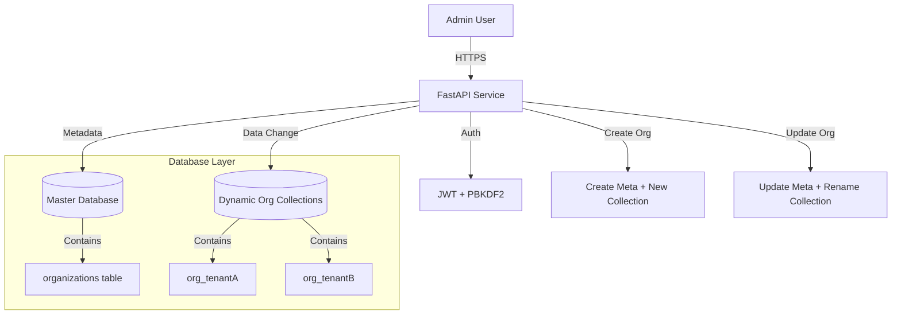

# Design & Architecture

## High-Level Architecture
The system follows a **Multi-tenant** architecture using a "Shared Database, Separate Collections" approach.

## detailed Design Choices

### 1. Database Strategy: "Collection per Tenant"
We chose to create a separate MongoDB collection for each organization (e.g., `org_google`, `org_amazon`).
*   **Pros**:
    *   **Data Isolation**: High. Data for one tenant is physically separated in a different namespace.
    *   **Backup/Restore**: Easier to backup specific tenants.
    *   **Performance**: Indices are smaller and dedicated to the tenant.
*   **Cons**:
    *   **Complexity**: Requires dynamic collection management (creation/deletion).
    *   **Renaming**: Renaming an organization requires a database-level `renameCollection` operation (which we implemented).

### 2. Authentication: stateless JWT
We use JSON Web Tokens (JWT) for authentication.
*   **Flow**: Admin logs in -> Server verifies hash -> Server signs JWT with `Organization Name` -> Admin sends JWT in header.
*   **Stateless**: The server doesn't need to store session data, making it easier to scale.

### 3. Password Hashing
We used `PBKDF2-SHA256` via `passlib`.
*   **Reason**: It is a standard, secure hashing algorithm that is universally supported and avoids some platform-specific binary dependency issues (like `bcrypt` on certain environments).

## Scalability Analysis
*   **Current State**: Can easily handle thousands of organizations.
*   **Bottleneck**: If we reach 100,000+ organizations, having 100k collections might strain the MongoDB metadata server.
*   **Future Scale**: For massive scale, we would switch to **Sharding** where we group tenants into shards, or use a `tenant_id` column in a shared collection (Row-level Multi-tenancy).
